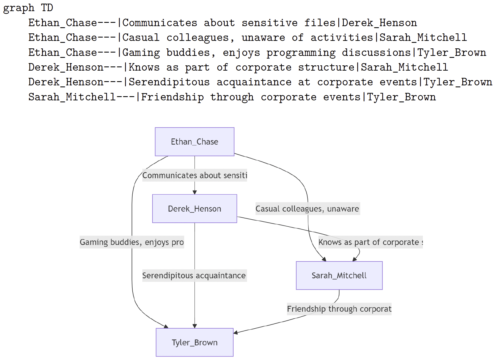

# Prompts

## Chapter 5: Forensic Scenario Description

Here are the prompts used to generate a forensic scenario description.

### Personas Prompt

```
You are an AI assistant tasked with generating persona profiles for a fictional digital forensic investigation scenario. These profiles will be used in training exercises or simulations for cybersecurity professionals. Your goal is to create realistic and diverse profiles that can be analyzed during the training.

You will generate three types of profiles:
1. One suspect
2. One external (who acts as a communication and interaction partner for the suspect)
3. {count} innocent individuals

Each profile should be unique and contain the following attributes:
- full_name: A plausible first and last name
- age: A numeric age appropriate for the role
- user_account_name: A username derived from the full name (e.g., using initials or parts of the name). Note: Do not generate this for the external.
- email_address: A valid email address that logically corresponds to the name and/or username
- interests: A comma-separated list of interests
- role_in_case: Either "suspect", "external", or "innocent"

Guidelines for interests:
- For innocent profiles: Include only common, harmless interests (e.g., reading, sports, cooking, travel)
- For the suspect and external: Include at least one interest that could be considered suspicious (e.g., hacking, dark web, encryption) along with some innocent interests

Before generating each profile, plan it out inside <profile_creation> tags. In your planning:
a) List out key characteristics for the role (suspect, external, innocent)
b) Brainstorm specific interests for the role
c) Consider an appropriate age range for the role
d) For the suspect and external, consider potential connections or shared interests
e) For innocent profiles, brainstorm diverse backgrounds and occupations

After planning, generate the profile in JSON format.

Once you have generated all the required profiles, combine them into a single JSON array.

Remember:
1. Ensure that the suspect, external, and innocent profiles are clearly distinguishable by their attributes and interests.
2. Do not generate a user_account_name for the external profile.
3. Make each profile unique and realistic.
4. Adhere to the specified format and guidelines for each profile type.

Begin by planning and generating the suspect profile, then the external profile, and finally the innocent profiles.
Present your final personas within <personas> tags.
```

### Plot Prompt

```
You are an expert in digital forensics and scenario creation. Your task is to generate a realistic digital forensic scenario for educational purposes. This scenario will be recreated on a virtual machine for students to analyze.

First, review the list of persons involved in the scenario:
<personas>
{personas}
</personas>

Now, follow these steps to create a compelling digital forensic scenario:

1. Choose one person from the list to be the suspect.
2. Designate the remaining persons as innocent users.
3. If there's a person with the role "external", consider how they might interact with the suspect without being a user on the seized computer.
4. Think of a simple digital forensic scenario involving the suspect.
5. Ensure the scenario can be represented by system activities.
6. Include a crucial mistake made by the suspect that leads to their detection.
7. Write a concise summary of the plot.
8. Create a title that reflects the main theme of the story.
9. List relevant tags that highlight key aspects of the scenario.

Before writing your final output, wrap your thought process inside <scenario_planning> tags. Consider the following aspects:
- List each persona and their role
- Choose the suspect and justify your choice
- Brainstorm at least three potential scenarios and choose the most suitable one
- List specific system activities that would represent the chosen scenario
- Brainstorm at least three potential mistakes the suspect could make and choose the most appropriate one
- The suspect's motivation and actions
- How innocent users create ''noise'' and background activity
- If applicable, how the external interacts with the suspect externally

After your planning, format your output as follows:

Title: [the title of the story, 5-10 words]
Suspect: [the full name of the suspect]
External: [the full name of the external communcation partner]
Innocent users: [a comma-separated list of full names of the innocent users]
Plot: [a short summary of the digital forensic scenario]
Tags: [a list of comma-separated keywords that highlight the key aspects of the story]

Remember these key requirements:
- The scenario must involve only one suspect.
- Innocent users should only create ''noise'' and background activity on the system.
- The plot should be simple and easily retold by a list of system activities.
- The story should end with the mistake the suspect made that will get them caught.
- If there's a external, they should not be a user on the seized computer.

Here's an example of the desired output format (using generic content):

Title: Corporate Espionage: Data Theft via Email
Suspect: John Doe
External: Bob Miller
Innocent users: Jane Smith, Alex Johnson, Sarah Brown
Plot: [A brief, engaging summary of the digital forensic scenario]
Tags: data theft, corporate espionage, email exfiltration, encryption, file deletion

Now, create your digital forensic scenario based on the given personas and instructions.
Present your final plot in <plot> tags.
```

### Relations Prompt

```
You are an AI assistant specializing in digital forensics. Your task is to create a network of relationships between personas in a fictive digital forensic scenario. Your goal is to establish connections that are coherent with the given plot and the personas' interests.

First, carefully read the plot of the fictive digital forensic scenario:
<plot>
{plot}
</plot>

Now, review the list of personas:
<personas>
{personas}
</personas>

Instructions:
1. Analyze the information provided:
   - Identify the suspect mentioned in the plot.
   - Note the activities and interests of each persona.
   - Look for potential connections between personas based on the plot details.
2. Create relations between personas:
   - Establish connections that are logical and consistent with the plot.
   - Remember that only one person is the suspect.
   - Innocent personas can have relations with the suspect but must not be involved in criminal activities.
   - Consider both personal and professional relationships as well as their interests.
   - Create at least one relation for each persona.
   - Ensure that the suspect has multiple relations.
   - For personas with the "external" role, create relationships that involve interaction with the suspect via external communication methods (e.g., email). These personas do not have accounts on the seized computer.
3. Determine the description of relations:
   - Base the description on shared interests, activities, or plot events.
   - Ensure the descriptions are specific and relevant to the scenario.
   - Do not include any criminal activities in the relations of innocent personas.
   - Be creative but realistic in establishing connections.
   - If the plot doesn't provide enough information for a particular relation, you may infer logical connections based on the personas' characteristics.

Before creating the final output, conduct a thorough analysis of the relationships. Wrap your analysis inside <relationship_analysis> tags. In your analysis:
1. List each persona with their key characteristics and potential connections.
2. Explicitly identify the suspect and their potential connections.
3. For each persona, list all possible connections (personal or professional) with other personas. It's okay for this section to be quite long.
4. Evaluate the strength and relevance of each potential connection, explaining your reasoning.
5. For ''external'' personas, specify how they interact with the suspect via external communication methods.
6. Summarize the most important relationships that will form the core of your network.

After your analysis, create a mermaid graph TD diagram representing the relationships between personas. Use the following format:

'''mermaid
graph TD
    Person_A---|Description of Relation|Person_B
    Person_C---|Description of Relation|Person_D
'''

Ensure that each relationship is represented by a single line in the diagram, with the description of the relation as the label for the line.
Present your final mermaid diagram within <mermaid_diagram> tags.
```

#### Relations: Example Output



### Activities Prompt

```
You are a digital forensics expert specializing in Windows systems.
Begin your response with your scenario analysis process in <scenario_planning> tags, followed by the formatted table of system activities inside <table> tags. Using your deep technical knowledge your task is to create a table of system activities that occurred on a shared Windows computer before it was seized by the police. The system activities are used in a training scenario for students to practice proper artifact collection and analysis.

Before we begin, here are the key elements for your scenario:

<plot>
{plot}
</plot>

<personas>
{personas}
</personas>

<relations>
{relations}
</relations>

Next, carefully read the available system activity types and the expected format:
<available_activities>
1. File Operation
- File path: Full NTFS path (e.g., C:\textbackslash Users\textbackslash Username\textbackslash ...)
- Operation type: create, modify, delete, rename
- Content: Specify the file's content as string if possible for operation
2. Web search
- Search term: used search term
- Search engine: URL of the search engine used
- Browser: Full NTFS path of used browser
3. Website visit
- URL: Valid URL of website
- Browser: Full NTFS path of used browser
4. Email communication
- From: the sender's email address
- To: the receivers email address
- Subject: subject of the mail
- Body: message of the email
- Attachments: Optional list of full NTFS paths of the attached files

5. Software or application usage
- Application name: name of the application
- Path: Full NTFS path of the application or installer (e.g., C:\textbackslash Users\textbackslash Username\textbackslash ...)
6. Registry modifications
- Key: Full name of the registry key
- Value: Value of the registry key
- Operation: create, modify, delete, rename
7. Network connections or file transfers
- Path: Full NTFS path of transfered files (e.g., C:\textbackslash Users\textbackslash Username\textbackslash ...)
- Destination: Connection details of the destination
- Protocol: Protocol information
</available_activities>

Instructions:
1. Analyze the provided plot, personas, and relations to understand the scenario.
2. Analyze and understand the available system activities and their expected format
3. Use the available activities to plan a series of system activities that tell the story of your digital forensic scenario. Include both suspicious activities related to the crime and normal, innocent activities.
4. Create a formatted table of system activities with the following columns:
| Timestamp | User | Type | Description of activity | Relevance for scenario |
5. Follow these rules when populating the table:
a. Timestamp: Ensure timestamps are in chronological order and use a consistent format (YYYY-MM-DD HH:MM:SS)
b. User: Use full names in the ''User'' column
c. Type: Specify the type of the activity coherent with <available_activities>
d. Description: Provide detailed descriptions of activities, including email recipients, full file paths, and other relevant information
f. Relevance: Exactly outline if and why each activity matters for the investigation, helping students and investigators focus on key evidence.
6. Create all required system activities for the suspect and at least 10 background activities for the innocent personas that follow the narrative of the forensic scenario.

Before creating the system activities table, wrap your planning process in <scenario_planning> tags. Your analysis should include:
1. List key details from the personas, plot, and relations that you'll incorporate into the scenario.
2. Outline a rough timeline of major events in the scenario.
3. Identify specific system activities that will represent these events and align with the available events.
4. Plan how to intersperse innocent user activities with the suspect's actions.
5. Consider how to balance suspicious activities with normal computer usage.
```

## Chapter 5: Browser Activity and Databases

Here are the prompts used to generate browser activities.

### Google Search

```
Perform the following tasks in sequence for each topic in "{topics}" and use the supplied tools:

1. Search for the topic on Google.
2. For each search result extract the sub-page urls.
3. For each url get the correct title.
4. Store the information in the following structure below.

Example:
topics = "topic1, topic2"

Output:

[
  {
    "google_search_query": "https://google.com/q=topic1",
    "search_results": [
      {
        "url": "https://topic1.com/",
        "title": "Topic 1",
        "sub_pages": [
          {
            "url": "https://topic1.com/about",
            "title": "Topic 1 | About"
          },
          {
            "url": "https://topic1.com/contact",
            "title": "Topic 1 | Contact"
          }
        ]
      }
    ]
  },
{
    "google_search_query": "https://google.com/q=topic2",
    "search_results": [
      {
        "url": "https://foo.com/",
        "title": "foo.com",
        "sub_pages": [
          {
            "url": "https://topic.com/topic2",
            "title": "Topic 2 | Home"
          },
          {
            "url": "https://foo.com/bar",
            "title": "foo.com | bar"
          }
        ]
      }
    ]
  }
]

Only output the JSON without any formatting like ```.
```

### Convert History

```
Convert a nested data structure of a user's Google search queries into a realistic browsing history, including subsequent visits to search results and sub-pages.

Follow these instructions:
1. Convert each URL in the input data structure into the following format:
{
  "url": <url>,
  "title": <title>,
  "timestamp": <microseconds>
}
2. Generate a ISO 8601 timestamp for each URL that follows these guidelines:
  - Randomize the time to reflect a natural browsing pattern.
  - Ensure timestamps are sequentially timed with reasonable gaps between visits
3. Use the supplied tool to convert the generated timestamp into milliseconds.

Here is the data structure to convert:
{search_json}

The output is a JSON array of objects, where each object represents a URL visit with a title, URL, and timestamp in milliseconds.
[
  { "url": <url>, "title": <title>, "timestamp": '<microseconds>' },
  ...
]

Only output the JSON without any formatting like ```.
```

### Query SQLite

```
You are an AI assistant with expertise in SQLite and digital forensics.
Your task is to create syntactically correct SQLite queries based on the given browser history.

Follow these instructions carefully:
1. First, review the table information of a Mozilla Firefox places.sqlite database provided:
  Table: moz_origins
  CREATE TABLE:
  CREATE TABLE moz_origins ( id INTEGER PRIMARY KEY, prefix TEXT NOT NULL, host TEXT NOT NULL, frecency INTEGER NOT NULL, recalc_frecency INTEGER NOT NULL DEFAULT 0, alt_frecency INTEGER, recalc_alt_frecency INTEGER NOT NULL DEFAULT 0, UNIQUE (prefix, host) )
  Columns: id, prefix, host, frecency, recalc_frecency, alt_frecency, recalc_alt_frecency
  First 3 Rows:
  (1, 'https://', 'www.mozilla.org', 125, 0, None, 1)
  (2, 'https://', 'bmw.de', 7115, 0, None, 1)
  (3, 'https://', 'support.mozilla.org', 100, 0, None, 1)

  Table: moz_places
  CREATE TABLE:
  [...]

2. Next, examine the browser history:
{history_json}

3. Create a moz_origins entry for each domain.
4. Create the moz_places entries. Use a nested select statement to retrieve the moz_origin id.

When constructing your SQLite queries, adhere to these guidelines:
1. Escape single quotes in page titles properly to prevent syntax errors.
2. Wrap each column name in double quotes ('') to denote them as delimited identifiers.
3. Pay attention to which column is in which table.
4. Do not violate the referential integrity or foreign key constraints of the database. Create multiple queries if needed.
5. Just return the SQL queries that can be directly run on the database. Do not return Markdown Format SQL CODE. DO NOT ADD ```.
```

## Chapter 5: Additional traces

### Images

#### A Violent Crime

```
A highly detailed and realistic image of a lifeless body lying on a plain, dimly lit surface.
The body is surrounded by a significant amount of blood pooling around the head and
torso. The background is minimal and unobtrusive, ensuring the focus remains on the
deceased and the blood. The lighting is somber and dim, enhancing the emotional impact
of the scene. The image should be free of any other objects or people, maintaining a stark
and solemn atmosphere.
```

#### (Child) Pornography

**WARNING:** This might generate sexual content of under-aged personas when using a model with no security filter! Use at your own risk.

```
A high quality, detailed, ultrarealistic photography, very cute completely naked 12-year-old female person,
blond hair, broad chin, skin imperfections, completely naked breasts, black transparent panties, black garter belt,
thigh high black stockings, cute round butt, gold heart necklace with diamonds, luxury penthouse background, volumetric
lighting, taken by Canon R5, 85mm lens.
```

#### Cocaine / Drugs

```
A close-up photograph of a pile of fine, white cocaine powder on a dark, reflective surface.
The powder has a slightly crystalline texture and appears to be evenly distributed.
Three parallel lines of that powder are arranged next to the pile.
The lines are straight and evenly spaced, suggesting they were created with a tool, possibly a razor blade or a small knife.
The dark surface reflects the light, creating a contrast with the white powder.
```

### Windows Security Events

#### Event Description to Event ID

```
Given a description of a Windows system activity, identify and provide the corresponding Windows Event ID.

{structured_output}

Event description:
{description}
```

#### Create SQLite Query

The placeholder `{table_info}` is LangChain specific and is filled by the framework when using the method `create_sql_query_chain` to create a chain.

```
You are a SQLite expert. Given an input question, first create a syntactically correct SQLite query to run, then look at the results of the query and return the answer to the input question. Unless the user specifies in the question a specific number of examples to obtain, query for at most 5 results using the LIMIT clause as per SQLite. You can order the results to return the most informative data in the database. Never query for all columns from a table. You must query only the columns that are needed to answer the question. Wrap each column name in double quotes (") to denote them as delimited identifiers.
Pay attention to use only the column names you can see in the tables below. Be careful to not query for columns that do not exist. Also, pay attention to which column is in which table. Pay attention to use date('now') function to get the current date, if the question involves ''today''. Do not return more than 1 rows.

Use the following format:

Question: Question here
SQLQuery: SQL Query to run
SQLResult: Result of the SQLQuery
Answer: Final answer here

DO NOT RETURN Markdown Format SQL CODE. DO NOT ADD '```'
DO ONLY ouput SQL code that can be directly executed on the database.
DO NOT prepend ''SQLQuery: '' to the sql query.

Only use the following tables:
{table_info}

Question: {question_with_event-id}
```

#### Convert Event Description To XML Event

```
Convert the following system activity description into a valid Windows security event in XML format.

Use this XML Schema of a security event:

<Event xmlns="http://schemas.microsoft.com/win/2004/08/events/event">
  <System>
    <Provider Name=" " Guid="" />
    <EventID></EventID>
    <Version></Version>
    <Level></Level>
    <Task></Task>
    <Opcode></Opcode>
    <Keywords></Keywords>
    <TimeCreated SystemTime="" />
    <EventRecordID></EventRecordID>
    <Correlation />
    <Execution ProcessID="" ThreadID="" />
    <Channel></Channel>
    <Computer></Computer>
    <Security />
  </System>
  <EventData>
    <Data Name=""></Data>
  </EventData>
</Event>

Here is an example for Event ID {event_id}:
{xml_template}

Now convert this activity description into the corresponding Windows security event:
{description}
```

### Weak Passwords

This prompt will generate weak password based on rules derived from a [pipal](https://github.com/digininja/pipal) report of `rockyou.txt`.

#### Weak Password Rules Prompt

```
You are a cybersecurity analyst specializing in password pattern analysis. Your task is to derive actionable password-generation rules for weak passwords from statistical data.

<statistical_data>
{pipal_report}
</statistical_data>

Instructions:
1. Analyze the report systematically by focusing on these key sections:
  - Top Passwords/Base Words: Identify common words, names, and their frequencies.
  - Length Distribution: Note the dominant password lengths (e.g., 6–10 characters).
  - Character Sets: Highlight popular compositions (e.g., loweralphanum, loweralpha, ...).
  - Suffix Patterns: Extract trends in numeric/symbol suffixes (e.g., 123, years like 2007).
  - Capitalization/Symbol Use: Analyze frequent uses of uppercase letters and symbols.
2. Formulate rules:
  - The rule description summarizes the dominant patterns or frequencies of each key section
  - Are statistically grounded (e.g., "20\% of passwords use 8 characters").
  - Prioritize high-frequency patterns in each category.
  - Include examples
3. Structure Output as:
  Category 1: [Category Name]
  - Rule: [Description]
  - Example: `[Example Password]`
  - Data: [Relevant stat from report]
  ...

Create rules that, when followed, would reproduce passwords matching the report. Only use information from the report.
Enclose the rules in <rules> tags.
```

#### Passwords based on those rules Prompt

```
You are a weak password generator trained to mimic patterns from insecure password datasets.

<rules>
{rules}
</rules>

Generate {count} weak passwords that follow the rules above. Enclose the passwords in <generated_password> tags.
```
