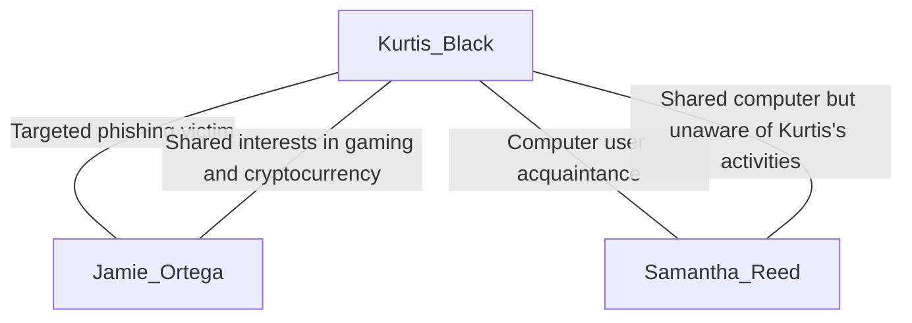
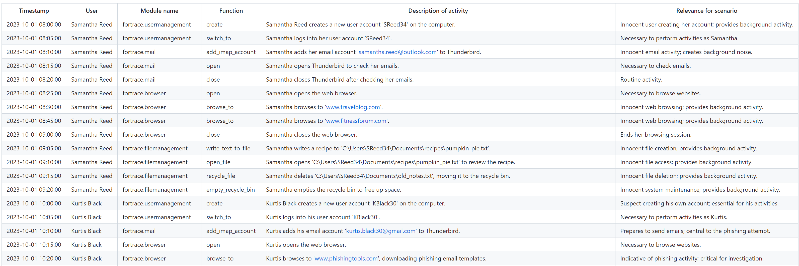
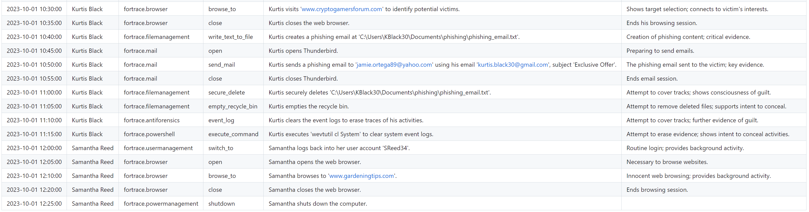

# Prompts

## Chapter 6: Create Vector Storage

Here are the prompts used to enhance ForTrace's module docstrings and create a JSON schema for each.

### Enhance Docstring

```
You are given a Python function and its parameters. Your task is to create a clear, well-structured Sphinx-style docstring.

<docstring>
{docstring}
</docstring>

<code>
{code}
</code

Follow these guidelines:

1. Summarize the function in a single sentence or short paragraph, describing its main purpose or functionality.
2. List the parameters in :param: fields and provide:
  - A concise description of what each parameter does.
  - Whether it is required or optional.
  - The default value if it is optional.
  - Relevant conditions or contexts in which the parameter applies (e.g. "Required for 'create_container'").
3. Use bullet points to list supported values for parameters when applicable.
4. Include a :type: field for each parameter, specifying the data type.
5. Describe the return value with :returns: and use :rtype: to specify the return type (e.g., None or a specific type).
6. Maintain consistent formatting and ensure that the docstring is easy to read and parse.
7. Preserve clarity and completeness by providing any extra context or usage notes that would help someone understand how to call the function properly.

Output the docstring enclosed in <enhanced_docstring> tags.
```

### Create RAG Schema

```
You are tasked with generating a JSON schema that describes all possible functions of a framework's module. You will be provided with a module description and some YAML examples. Your goal is to create a comprehensive JSON schema based on this information.

Here is the JSON template you should use as a basis for your schema:

{
  "module": "MODULE_NAME",
  "functions": [
    {
      "action": "ACTION_NAME",
      "description": "DESCRIPTION_OF_ACTION",
      "examples": [
        {
          "yaml": "YAML_EXAMPLE",
          "description": "DESCRIPTION_OF_EXAMPLE"
        }
      ],
      "properties": {
        "PROPERTY_NAME": {
          "description": "DESCRIPTION_OF_PROPERTY",
          "required": true,
          "type": "PROPERTY_TYPE"
        }
      }
    }
  ]
}

First, carefully read the sphinx formatted module description:
<module_description>
{docstring_enhanced}
</module_description>

Next, examine the YAML examples:
<yaml_examples>
{yaml_examples}
</yaml_examples>

To generate the JSON schema:

1. Identify the module name from the description and use it to replace "MODULE_NAME" in the template.
2. For each function or action mentioned in the description or shown in the YAML examples:
   a. Create a new object in the "functions" array.
   b. Set the "action" field to the name of the function.
   c. Write a brief description of the action in the "description" field.
   d. If there's a relevant YAML example, include it in the "examples" array with a brief description.
   e. Identify all properties used by the function and list them in the "properties" object.
   f. For each property:
      - Provide a description
      - Determine if it's required (set to true if it appears in all examples or is explicitly stated as required)
      - Specify the data type (string, boolean, integer, etc.)
3. Ensure that all functions and properties mentioned in the module description are included in the schema.
4. If there are any discrepancies between the description and the YAML examples, prioritize the information in the description, but include all properties found in the examples.
5. If any information is unclear or seems to be missing, make reasonable assumptions based on the context provided.

Present your final JSON schema within <json_schema> tags. Ensure that the schema is valid JSON and follows the structure of the provided template.
```

#### JSON Schema: Example Output

```json
{
  "module": "VeraCrypt",
  "functions": [
    {
      "action": "create_container",
      "description": "Creates a new VeraCrypt container.",
      "examples": [
        {
          "yaml": "- fortrace.veracrypt:\n    action: create_container\n    container_path: C:\\Users\\fortrace\\Desktop\\info.txt\n    size: 50M\n    password: SuperSafe123!\n    artifact_type: NEEDLE",
          "description": "Example of creating a VeraCrypt container with a specified path, size, password, and artifact type."
        }
      ],
      "properties": {
        "container_path": {
          "description": "The file path to the VeraCrypt container.",
          "required": true,
          "type": "string"
        },
        "size": {
          "description": "The size of the VeraCrypt container to create.",
          "required": true,
          "type": "string"
        },
        "password": {
          "description": "The password for the VeraCrypt container.",
          "required": true,
          "type": "string"
        },
        "artifact_type": {
          "description": "The type of artifact to add to the report.",
          "required": false,
          "type": "string"
        }
      }
    },
    {
      "action": "mount_container",
      "description": "Mounts an existing VeraCrypt container.",
      "examples": [
        {
          "yaml": "- fortrace.veracrypt:\n    action: mount_container\n    container_path: C:\\Users\\fortrace\\Desktop\\info.txt\n    mount_point: E\n    password: SuperSafe123!\n    artifact_type: NEEDLE",
          "description": "Example of mounting a VeraCrypt container with a specified path, mount point, password, and artifact type."
        }
      ],
      "properties": {
        "container_path": {
          "description": "The file path to the VeraCrypt container.",
          "required": true,
          "type": "string"
        },
        "mount_point": {
          "description": "The directory where the VeraCrypt container will be mounted.",
          "required": true,
          "type": "string"
        },
        "password": {
          "description": "The password for the VeraCrypt container.",
          "required": true,
          "type": "string"
        },
        "artifact_type": {
          "description": "The type of artifact to add to the report.",
          "required": false,
          "type": "string"
        }
      }
    },
    {
      "action": "unmount_container",
      "description": "Unmounts a mounted VeraCrypt container.",
      "examples": [
        {
          "yaml": "- fortrace.veracrypt:\n    action: unmount_container\n    mount_point: E\n    artifact_type: NEEDLE",
          "description": "Example of unmounting a VeraCrypt container from a specified mount point with an artifact type."
        }
      ],
      "properties": {
        "mount_point": {
          "description": "The directory where the VeraCrypt container is mounted.",
          "required": true,
          "type": "string"
        },
        "artifact_type": {
          "description": "The type of artifact to add to the report.",
          "required": false,
          "type": "string"
        }
      }
    }
  ]
}
```

## Chapter 6: Creation of a Synthetically Generated Configuration File for ForTrace

Here are the prompts used to generate a synthetic YAML configuration for ForTrace.

### Generate Personas

```
You are an AI assistant tasked with generating persona profiles for a fictional digital forensic investigation scenario. These profiles will be used in training exercises or simulations for cybersecurity professionals. Your goal is to create realistic and diverse profiles that can be analyzed during the training.

# Tools
You are supplied with a tool "get_mail_providers" that returns a list of allowed mail providers for each profile's email address.
You are supplied with a tool "get_mail_provider_configuration" that returns the mail settings for a specific mail provider.

Here is the number of innocent profiles you need to generate:
<count>
{count}
</count>

You will generate three types of profiles:
1. One suspect
2. One external (who acts as a communication and interaction partner for the suspect)
3. The number of innocent individuals specified in the <count> tags above

Each profile should be unique and contain the following attributes:
- full_name: A plausible first and last name
- age: A numeric age appropriate for the role
- user_account_name: A username derived from the full name (e.g., using initials or parts of the name). Note: Do not generate this for the external.
- mail_settings: An object of multiple mail settings
  - email_address: A valid email address that logically corresponds to the name and/or username.
  - imap_server: the address of the mail provider's IMAP server
  - smtp_server: the address of the mail provider's SMTP server
  - socket_type: a numeric value for the socket type
  - socket_type_smtp: a numeric value for the SMTP's socket type
  - auth_method_smtp: a numeric value for the sMTP's auth method
- interests: A comma-separated list of interests
- role_in_case: Either "suspect", "external", or "innocent"

Guidelines for interests:
- For innocent profiles: Include only common, harmless interests (e.g., reading, sports, cooking, travel)
- For the suspect and external: Include at least one interest that could be considered suspicious (e.g., hacking, dark web, encryption) along with some innocent interests

Before generating each profile, plan it out inside <profile_creation> tags. In your planning:
a) List out key characteristics for the role (suspect, external, innocent)
b) Brainstorm specific interests for the role
c) Consider an appropriate age range for the role
d) For the suspect and external, consider potential connections or shared interests
e) For innocent profiles, brainstorm diverse backgrounds and occupations

After planning, generate the profile in JSON format.

Once you have generated all the required profiles, combine them into a single JSON array.

Remember:
1. Ensure that the suspect, external, and innocent profiles are clearly distinguishable by their attributes and interests.
2. Do not generate a user_account_name for the external profile. A persona with role 'external' also has mail settings.
3. Make each profile unique and realistic.
4. Adhere to the specified format and guidelines for each profile type.

Begin by planning and generating the suspect profile, then the external profile, and finally the innocent profiles.
Present your final personas within <personas> tags.
```

#### Personas: Example Output

```json
[
  {
    "full_name": "Kurtis Black",
    "age": 30,
    "user_account_name": "KBlack30",
    "mail_settings": {
      "email_address": "kurtis.black30@web.de",
      "imap_server": "imap.web.de",
      "smtp_server": "smtp.web.de",
      "socket_type": 3,
      "socket_type_smtp": 3,
      "auth_method_smtp": 3
    },
    "interests": "hacking, gaming, photography, cryptocurrencies, cybersecurity",
    "role_in_case": "suspect"
  },
  {
    "full_name": "Jamie Ortega",
    "age": 28,
    "mail_settings": {
      "email_address": "jamie.ortega89@freenet.de",
      "imap_server": "mx.freenet.de",
      "smtp_server": "mx.freenet.de",
      "socket_type": 2,
      "socket_type_smtp": 2,
      "auth_method_smtp": 3
    },
    "interests": "technology, online gaming, cryptocurrencies, astronomy, photography",
    "role_in_case": "external"
  },
  {
    "full_name": "Samantha Reed",
    "age": 34,
    "user_account_name": "SReed34",
    "mail_settings": {
      "email_address": "samantha.reed@freenet.de",
      "imap_server": "mx.freenet.de",
      "smtp_server": "mx.freenet.de",
      "socket_type": 2,
      "socket_type_smtp": 2,
      "auth_method_smtp": 3
    },
    "interests": "traveling, reading, fitness, cooking, gardening",
    "role_in_case": "innocent"
  }
]
```

### Generate Plot

```
You are an expert in digital forensics and scenario creation. Your task is to generate a realistic digital forensic scenario for educational purposes. This scenario will be recreated on a virtual machine for students to analyze.

First, review the list of persons involved in the scenario:

<personas>
{personas}
</personas>

<available_activities>
fortrace.mail:
  - open: Opens Thunderbird with the provided password.
  - add_imap_account: Adds an IMAP account to Thunderbird with the specified details.
  - send_mail: Sends an email using Thunderbird with the specified details.
  - close: Closes Thunderbird.

fortrace.powermanagement:
  - shutdown: Shuts down the guest system.
  - reboot: Reboots the guest system. Requires the 'boot_time' parameter.

fortrace.filemanagement:
  - recycle_file: Moves the specified file to the recycle bin.
  - empty_recycle_bin: Empties the recycle bin for all drives.
  - secure_delete: Permanently deletes the specified file using a secure deletion method.
  - write_text_to_file: Writes the provided content to the specified file.
  - open_file: Opens the specified file using the default application.

fortrace.powershell:
  - execute_command: Executes the provided PowerShell command on the guest system.

fortrace.veracrypt:
  - create_container: Creates a new VeraCrypt container.
  - mount_container: Mounts an existing VeraCrypt container.
  - unmount_container: Unmounts a mounted VeraCrypt container.

fortrace.filetransfer:
  - smb_copy: Copies files from the SMB share to the guest.
  - win_copy: Copies files within the Windows guest system.
  - open_smb: Opens an SMB connection for file sharing.
  - close_smb: Closes an open SMB connection.
  - copy: Copies files directly within the guest system.
  - host_copy: Copies files from the host to the guest system.

fortrace.usermanagement:
  - create: Create a new user.
  - delete: Delete an existing user.
  - switch_to: Switch to the specified user.

fortrace.browser:
  - open: Opens the browser.
  - browse_to: Navigates the browser to a specified URL.
  - close: Closes the browser.

fortrace.antiforensics:
  - recycle_bin: Enable or disable the recycle bin functionality.
  - prefetch: Enable, disable or clear the creation of Prefetch data.
  - thumbcache: Enable, disable or delete Thumbcache files.
  - recent_files: Enable or disable tracking of recently opened files.
  - event_log: Enable, disable or clear event log entries or files.
  - user_assist: Enable, disable or clear User Assist entries in the Registry.
  - hibernation: Enable or disable the creation of hibernation files.
  - pagefile: Enable or disable the creation and usage of the page file.
  - jump_lists: Enable, disable or delete jump list files.
  - recent_docs: Enable, disable or delete recently accessed document entries in the Registry.
<available_activities>

Now, follow these steps to create a compelling digital forensic scenario:

1. Choose one person from the list to be the suspect.
2. Designate the remaining persons as innocent users.
3. If there's a person with the role "external", consider how they might interact with the suspect without being a user on the seized computer.
4. Think of a simple digital forensic scenario involving the suspect.
5. Ensure the scenario can be represented by the activities referenced by <available_activities>.
6. Include a crucial mistake made by the suspect that leads to their detection.
7. Write a concise summary of the plot.
8. Create a title that reflects the main theme of the story.
9. List relevant tags that highlight key aspects of the scenario.

Before writing your final output, wrap your thought process inside <scenario_planning> tags. Consider the following aspects:
- List each persona and their role
- Choose the suspect and justify your choice
- Brainstorm at least three potential scenarios and choose the most suitable one
- List specific system activities that would represent the chosen scenario and are part of <available_activities>
- Brainstorm at least three potential mistakes the suspect could make and choose the most appropriate one
- The suspect's motivation and actions
- How innocent users create "noise" and background activity
- If applicable, how the external interacts with the suspect externally

After your planning, format your output as follows:

Title: [the title of the story, 5-10 words]
Suspect: [the full name of the suspect]
External: [the full name of the external communcation partner]
Innocent users: [a comma-separated list of full names of the innocent users]
Plot: [a short summary of the digital forensic scenario]
Tags: [a list of comma-separated keywords that highlight the key aspects of the story]

Remember these key requirements:
- The scenario must involve only one suspect.
- Innocent users should only create "noise" and background activity on the system.
- The plot should be simple and easily retold by a list of system activities.
- The story should end with the mistake the suspect made that will get them caught.
- If there's a external, they should not be a user on the seized computer.

Here's an example of the desired output format (using generic content):

<plot>
Title: Corporate Espionage: Data Theft via Email
Suspect: John Doe
External: Bob Miller
Innocent users: Jane Smith, Alex Johnson, Sarah Brown
Plot: [A brief, engaging summary of the digital forensic scenario]
Tags: data theft, corporate espionage, email exfiltration, encryption, file deletion
</plot>

Now, create your digital forensic scenario based on the given personas and instructions.
Present your final plot in <plot> tags.
```

#### Plot: Example Output

```
Title: Phishing for Profit
Suspect: Kurtis Black
External: Jamie Ortega
Innocent users: Samantha Reed
Plot: Kurtis Black, a tech-savvy 30-year-old, attempts to steal cryptocurrency through targeted phishing emails sent to online gamers, including Jamie Ortega. Unfortunately for Kurtis, he uses his personal email account in the process, leaving a traceable link back to him. While Samantha Reed innocently uses the same computer, her unrelated activities create background noise that further mystifies the investigation while ultimately leading to Kurtis's capture due to his careless employment of personal correspondence.
Tags: phishing, cryptocurrency theft, email trail, digital forensics, suspect mistake
```


### Generate Relations

[See Chapter 5 - Generate Relations](chapter-5-prompts.md#generate-relations)

#### Relations: Example Output



### Generate Activities

```
You are a digital forensics expert specializing in Windows systems.
Using your deep technical knowledge your task is to create a table of system activities that occurred on a shared Windows computer before it was seized by the police.
The system activities are used in a training scenario for students to practice proper artifact collection and analysis.

# Function Calls
- 'get_interest_related_url': Creates a valid URL based on a certain topic or interest. You can call this function multiple times!

Before we begin, here are the key elements for your scenario:

<plot>
{plot}
</plot>

<personas>
{personas}
</personas>

<relations>
{relations}
</relations>

Next, carefully read the available system activities.
<available_activities>
| module name              | function           | description                                                                   |
|--------------------------|--------------------|-------------------------------------------------------------------------------|
| fortrace.mail            | open               | Opens Thunderbird with the provided password.                                 |
| fortrace.mail            | add_imap_account   | Adds an IMAP account to Thunderbird with the specified details.               |
| fortrace.mail            | send_mail          | Sends an email using Thunderbird with the specified details.                  |
| fortrace.mail            | close              | Closes Thunderbird.                                                           |
| fortrace.powermanagement | shutdown           | Shuts down the guest system.                                                  |
| fortrace.powermanagement | reboot             | Reboots the guest system. Requires the 'boot_time' parameter.                 |
| fortrace.filemanagement  | recycle_file       | Moves the specified file to the recycle bin.                                  |
| fortrace.filemanagement  | empty_recycle_bin  | Empties the recycle bin for all drives.                                       |
| fortrace.filemanagement  | secure_delete      | Permanently deletes the specified file using a secure deletion method.        |
| fortrace.filemanagement  | write_text_to_file | Writes the provided content to the specified file.                            |
| fortrace.filemanagement  | open_file          | Opens the specified file using the default application.                       |
| fortrace.powershell      | execute_command    | Executes the provided PowerShell command on the guest system.                 |
| fortrace.veracrypt       | create_container   | Creates a new VeraCrypt container.                                            |
| fortrace.veracrypt       | mount_container    | Mounts an existing VeraCrypt container.                                       |
| fortrace.veracrypt       | unmount_container  | Unmounts a mounted VeraCrypt container.                                       |
| fortrace.filetransfer    | smb_copy           | Copies files from the SMB share to the guest.                                 |
| fortrace.filetransfer    | win_copy           | Copies files within the Windows guest system.                                 |
| fortrace.filetransfer    | open_smb           | Opens an SMB connection for file sharing.                                     |
| fortrace.filetransfer    | close_smb          | Closes an open SMB connection.                                                |
| fortrace.filetransfer    | copy               | Copies files directly within the guest system.                                |
| fortrace.filetransfer    | host_copy          | Copies files from the host to the guest system.                               |
| fortrace.usermanagement  | create             | Create a new user.                                                            |
| fortrace.usermanagement  | delete             | Delete an existing user.                                                      |
| fortrace.usermanagement  | switch_to          | Switch to the specified user.                                                 |
| fortrace.browser         | open               | Opens the browser.                                                            |
| fortrace.browser         | browse_to          | Navigates the browser to a specified URL.                                     |
| fortrace.browser         | close              | Closes the browser.                                                           |
| fortrace.antiforensics   | recycle_bin        | Enable or disable the recycle bin functionality.                              |
| fortrace.antiforensics   | prefetch           | Enable, disable or clear the creation of Prefetch data.                       |
| fortrace.antiforensics   | thumbcache         | Enable, disable or delete Thumbcache files.                                   |
| fortrace.antiforensics   | recent_files       | Enable or disable tracking of recently opened files.                          |
| fortrace.antiforensics   | event_log          | Enable, disable or clear event log entries or files.                          |
| fortrace.antiforensics   | user_assist        | Enable, disable or clear User Assist entries in the Registry.                 |
| fortrace.antiforensics   | hibernation        | Enable or disable the creation of hibernation files.                          |
| fortrace.antiforensics   | pagefile           | Enable or disable the creation and usage of the page file.                    |
| fortrace.antiforensics   | jump_lists         | Enable, disable or delete jump list files.                                    |
| fortrace.antiforensics   | recent_docs        | Enable, disable or delete recently accessed document entries in the Registry. |
</available_activities>

Instructions:

1. Analyze the provided plot, personas, and relations to understand the scenario.
2. Analyze and understand the available system activities.
3. Use the available activities to plan a sequence of system events that follow the narrative of the forensic scenario
3.1 Including both suspicious and innocent actions.
3.2 Create least 10 background activities for the innocent personas that follow the narrative of the forensic scenario.
3.3 Ensure to maintain a consistent user behavior with no contradictions by following these rules for the activities:
  a. Every file must be created before use, with a valid file path.
  b. A user must create its own user account before he can perform actions. There is no System Admin on the computer.
  c. Always switch to the correct user before performing actions.
  d. A web browser must be opened before browsing to a website.
  e. An IMAP account must be added before opening the mail client or sending emails.
  f. Call the function 'get_interest_related_url' to get a valid URL for every 'browse_to' event e.g. " Navigated the web browser to the travel blog <return value of function> to get new travel ideas"
4. Create a formatted table of system activities with the following columns:
   | Timestamp | User | Module name | Function | Description of activity | Relevance for scenario |
5. Follow these rules when populating the table:
   a. Timestamp: Ensure timestamps are in chronological order and use a consistent format (YYYY-MM-DD HH:MM:SS)
   b. User: Use full names in the "User" column
   c. Module name: Classify the module's name of the function of the activity coherent with <available_activities>
   d. Function: Classify the name of the function of the activity
   e. Description: Provide detailed descriptions of activities, including email recipients, full file paths, and other relevant information
   f. Relevance: Exactly outline if and why each activity matters for the investigation, helping students and investigators focus on key evidence.

Remember these key requirements:
- The scenario must involve only one suspect.
- Innocent users should only create "noise" and background activity on the system.
- The plot should be simple and easily retold by a list of system activities.
- Remember to follow the rules for realistic user behavior before creating the system activities
- The story should end with the mistake the suspect made that will get them caught.
- If there's a external, they should not be a user on the seized computer.
- Always call the supplied function when you need an URL for a 'browse_to' event
- Focus on accuracy and respect the requirements in <available_activities>

Output a markdown formatted table of system activities within <activities> tags.
```

#### Activities: Example Output




### Generate YAML

The placeholder `{context}` is a LangChain specific variable filled by the framework when using a vector storage.

```
You are a digital forensic expert tasked with translating a table of system activities into a synthetic YAML configuration. This configuration should be coherent with the involved personas, their relations, and the plot that summarizes the narrative of the forensic story. Follow these instructions carefully to complete the task:

1. First, review the plot summary of the digital forensic story:
<plot>
{plot}
</plot>

2. Next, familiarize yourself with the personas involved in the scenario:
<personas>
{personas}
</personas>

3. Understand the relations between the personas:
<relations>
{relations}
</relations>

4. You will be working with a table of activities that has the following structure:
- Timestamp: Time when the activity happened on the system
- User: User who executed the action
- Module name: Name of the ForTrace module
- Function: Name of the module's function
- Description of activity: Detailed description of the activity

Here is the activities table:
<activities_table>
{activities}
</activities_table>

5. To generate the YAML sections, you will use the provided module schema. This schema contains JSON specifications for all available module functions that can be used to construct the activities. Here is the module schema:
<module_schema>
{context}
</module_schema>

6. When generating the YAML sections:
   a. Strictly follow the parameter specifications of each function as defined in the module schema.
   b. Ensure that the generated activities are coherent with the digital forensic narrative.
   c. If important information is missing in the activity's description for a required attribute, come up with realistic values that align with the overall narrative of the plot and the personas.

7. Use the following YAML template to generate your output:
<yaml>
name: [title of the plot]
description: [description of the plot]
scenario_options:
  export_dir: /data/export/
  guest_name: [guest_name]
  guest_platform: windows10
  scenario_start: "[scenario_start]"
  debug_level: DEBUG
scenario:
  - fortrace...
    action: ...
  [Include all translated YAML sections here]
</yaml>

8. Your final output should be a complete YAML configuration that includes all translated sections from the activities table. Ensure that the configuration is coherent with the plot, personas, and their relations. Pay close attention to the chronological order of events and the logical flow of activities.

Present your final YAML configuration within <final_yaml> tags.
```

#### YAML: Example Output

[scenario.yaml](./scenario.yaml)

```yaml
name: Phishing for Profit
description: Kurtis Black, a tech-savvy 30-year-old, attempts to steal cryptocurrency through targeted phishing emails sent to online gamers, including Jamie Ortega. Unfortunately for Kurtis, he uses his personal email account in the process, leaving a traceable link back to him. While Samantha Reed innocently uses the same computer, her unrelated activities create background noise that further mystifies the investigation while ultimately leading to Kurtis's capture due to his careless employment of personal correspondence.
author: John Doe
scenario_options:
  export_dir: /data/export/
  guest_name: SharedComputer
  guest_platform: windows10
  scenario_start: "2024-04-16 08:15:42"
  debug_level: DEBUG
scenario:
  - fortrace.usermanagement:
      action: create
      name: SReed34
      password: SecurePass123!
  - fortrace.usermanagement:
      action: switch_to
      name: SReed34
      password: SecurePass123!
  - fortrace.mail:
      action: add_imap_account
      imap_server: mx.freenet.de
      smtp_server: mx.freenet.de
      email_address: samantha.reed@freenet.de
      username: samantha.reed@freenet.de
      full_name: Samantha Reed
      socket_type: 2
      socket_type_smtp: 2
      auth_method_smtp: 3
  - fortrace.mail:
      action: open
      password: SamanthaMailPass!
  - fortrace.mail:
      action: close
  - fortrace.browser:
      action: open
  - fortrace.browser:
      action: browse_to
      url: 'https://twentyonetravel.com/reisen/'
  - fortrace.browser:
      action: browse_to
      url: 'https://www.fitness-foren.de/forums/laufsport.90/'
  - fortrace.browser:
      action: close
  - fortrace.filemanagement:
      action: write_text_to_file
      filepath: 'C:\Users\SReed34\Documents\pumpkin_pie.txt'
      filecontent: 'Ingredients:

        - Pumpkin puree

        - Sugar

        - Flour

        - Instructions:
        
        1. Mix ingredients together.
        2. Bake at 350°F for 30 minutes.'
  - fortrace.filemanagement:
      action: open_file
      filepath: 'C:\Users\SReed34\Documents\pumpkin_pie.txt'
  - fortrace.filemanagement:
      action: empty_recycle_bin
  - fortrace.usermanagement:
      action: create
      name: KBlack30
      password: SuspectPass456
      artifact_type: NEEDLE
  - fortrace.usermanagement:
      action: switch_to
      name: KBlack30
      password: SuspectPass456
      artifact_type: NEEDLE
  - fortrace.mail:
      action: add_imap_account
      imap_server: imap.web.de
      smtp_server: smtp.web.de
      email_address: kurtis.black30@web.de
      username: kurtis.black30@web.de
      full_name: Kurtis Black
      socket_type: 3
      socket_type_smtp: 3
      auth_method_smtp: 3
  - fortrace.browser:
      action: open
  - fortrace.browser:
      action: browse_to
      url: 'https://cyberphinix.de/de/blog/17-besten-phishing-tools/#evilginx2'
      artifact_type: NEEDLE
  - fortrace.browser:
      action: browse_to
      url: 'https://www.reddit.com/r/cryptogames/'
      artifact_type: NEEDLE
  - fortrace.browser:
      action: close
  - fortrace.filemanagement:
      action: write_text_to_file
      filepath: 'C:\Users\KBlack30\Documents\phishing_email.txt'
      filecontent: 'Subject: Exclusive Offer
        Dear Gamer,

        We are excited to offer you an exclusive opportunity to invest in our new cryptocurrency platform...'
  - fortrace.mail:
      action: open
      password: KurtisMailPass!
      artifact_type: NEEDLE
  - fortrace.mail:
      action: send_mail
      receiver: jamie.ortega89@freenet.de
      subject: "Exclusive Offer"
      message: "Dear Gamer
        
        We are excited to offer you an exclusive opportunity to invest in our new cryptocurrency platform..."
      artifact_type: NEEDLE
  - fortrace.mail:
      action: close
  - fortrace.filemanagement:
      action: secure_delete
      filepath: 'C:\Users\KBlack30\Documents\phishing_email.txt'
  - fortrace.filemanagement:
      action: empty_recycle_bin
  - fortrace.antiforensics:
      target: event_log
      status: cleared
  - fortrace.powershell:
      action: execute_command
      command: "wevtutil cl System"
      artifact_type: NEEDLE
  - fortrace.usermanagement:
      action: switch_to
      name: SReed34
      password: SecurePass123!
  - fortrace.browser:
      action: open
  - fortrace.browser:
      action: browse_to
      url: 'https://gardenbetty.com/how-to-harden-off-your-seedlings/'
  - fortrace.browser:
      action: close
  - fortrace.powermanagement:
      action: shutdown
```
