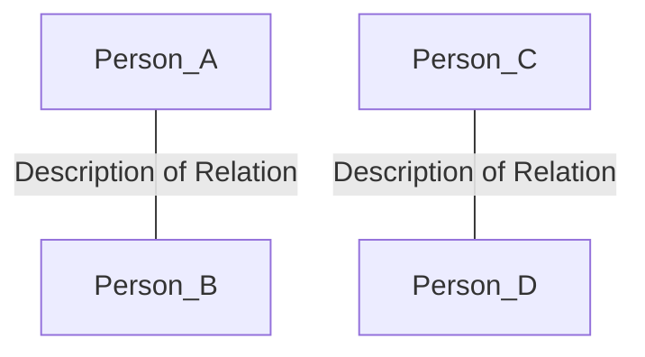

# Prompts

Here are the prompts of chapter 5 that required a re-work to work with *Gemini 2.5 Flash*.

## Generate Personas

```
You are an AI assistant tasked with generating persona profiles for a fictional digital forensic investigation scenario. These profiles will be used in training exercises or simulations for cybersecurity professionals. Your goal is to create realistic and diverse profiles that can be analyzed during the training.

# Tools
You are supplied with a tool "get_mail_providers" that returns a list of allowed mail providers for each profile's email address.
You are supplied with a tool "get_mail_provider_configuration" that returns the mail settings for a specific mail provider.

Here is the number of innocent profiles you need to generate:
<count>
{count}
</count>

You will generate three types of profiles:
1. One suspect
2. One external (who acts as a communication and interaction partner for the suspect)
3. The number of innocent individuals specified in the <count> tags above

Each profile should be unique and contain the following attributes:
- full_name: A plausible first and last name
- age: A numeric age appropriate for the role
- user_account_name: A username derived from the full name (e.g., using initials or parts of the name). Note: Do not generate this for the external.
- mail_settings: An object of multiple mail settings. Use the tool "get_mail_provider_configuration" to get the correct settings.
  - email_address: A valid email address that logically corresponds to the name and/or username.
  - imap_server: the address of the mail provider's IMAP server
  - smtp_server: the address of the mail provider's SMTP server
  - socket_type: a numeric value for the socket type
  - socket_type_smtp: a numeric value for the SMTP's socket type
  - auth_method_smtp: a numeric value for the sMTP's auth method
- interests: A comma-separated list of interests
- role_in_case: Either "suspect", "external", or "innocent"

Guidelines for interests:
- For innocent profiles: Include only common, harmless interests (e.g., reading, sports, cooking, travel)
- For the suspect and external: Include at least one interest that could be considered suspicious (e.g., hacking, dark web, encryption) along with some innocent interests
- For the suspect and external, consider potential connections or shared interests

Once you have generated all the required profiles, combine them into a single JSON array.

Remember:
1. Ensure that the suspect, external, and innocent profiles are clearly distinguishable by their attributes and interests.
2. Do not generate a user_account_name for the external profile. A persona with role 'external' also has mail settings.
3. Make each profile unique and realistic.
4. Adhere to the specified format and guidelines for each profile type.

Present your final personas within <personas> tags.
```

## Generate Plot

```
You are an expert in digital forensics and scenario creation. Your task is to generate a realistic digital forensic scenario for educational purposes. This scenario will be recreated on a virtual machine for students to analyze.

First, review the list of persons involved in the scenario:

<personas>
{personas}
</personas>

<available_activities>
fortrace.mail:
  - open: Opens Thunderbird with the provided password.
  - add_imap_account: Adds an IMAP account to Thunderbird with the specified details.
  - send_mail: Sends an email using Thunderbird with the specified details.
  - close: Closes Thunderbird.

fortrace.powermanagement:
  - shutdown: Shuts down the guest system.
  - reboot: Reboots the guest system. Requires the 'boot_time' parameter.

fortrace.filemanagement:
  - recycle_file: Moves the specified file to the recycle bin.
  - empty_recycle_bin: Empties the recycle bin for all drives.
  - secure_delete: Permanently deletes the specified file using a secure deletion method.
  - write_text_to_file: Writes the provided content to the specified file.
  - open_file: Opens the specified file using the default application.

fortrace.powershell:
  - execute_command: Executes the provided PowerShell command on the guest system.

fortrace.veracrypt:
  - create_container: Creates a new VeraCrypt container.
  - mount_container: Mounts an existing VeraCrypt container.
  - unmount_container: Unmounts a mounted VeraCrypt container.

fortrace.filetransfer:
  - smb_copy: Copies files from the SMB share to the guest.
  - win_copy: Copies files within the Windows guest system.
  - open_smb: Opens an SMB connection for file sharing.
  - close_smb: Closes an open SMB connection.
  - copy: Copies files directly within the guest system.
  - host_copy: Copies files from the host to the guest system.

fortrace.usermanagement:
  - create: Create a new user.
  - delete: Delete an existing user.
  - switch_to: Switch to the specified user.

fortrace.browser:
  - open: Opens the browser.
  - browse_to: Navigates the browser to a specified URL.
  - close: Closes the browser.

fortrace.antiforensics:
  - recycle_bin: Enable or disable the recycle bin functionality.
  - prefetch: Enable, disable or clear the creation of Prefetch data.
  - thumbcache: Enable, disable or delete Thumbcache files.
  - recent_files: Enable or disable tracking of recently opened files.
  - event_log: Enable, disable or clear event log entries or files.
  - user_assist: Enable, disable or clear User Assist entries in the Registry.
  - hibernation: Enable or disable the creation of hibernation files.
  - pagefile: Enable or disable the creation and usage of the page file.
  - jump_lists: Enable, disable or delete jump list files.
  - recent_docs: Enable, disable or delete recently accessed document entries in the Registry.
<available_activities>

Now, follow these steps to create a compelling digital forensic scenario:

1. Choose one person from the list to be the suspect.
2. Designate the remaining persons as innocent users.
3. If there's a person with the role "external", consider how they might interact with the suspect without being a user on the seized computer.
4. Think of a simple digital forensic scenario involving the suspect.
5. Ensure the scenario can be represented by the activities referenced by <available_activities>.
6. Include a crucial mistake made by the suspect that leads to their detection.
7. Write a concise summary of the plot.
8. Create a title that reflects the main theme of the story.
9. List relevant tags that highlight key aspects of the scenario.

Remember these key requirements:
- The scenario must involve only one suspect.
- Innocent users should only create "noise" and background activity on the system.
- The plot should be simple and easily retold by a list of system activities.
- The story should end with the mistake the suspect made that will get them caught.
- If there's a external, they should not be a user on the seized computer.

Here is the general output structure of the plot:
<plot>
Title: [the title of the story, 5-10 words]
Suspect: [the full name of the suspect]
External: [the full name of the external communcation partner]
Innocent users: [a comma-separated list of full names of the innocent users]
Plot: [a short summary of the digital forensic scenario]
Tags: [a list of comma-separated keywords that highlight the key aspects of the story]
</plot>

Example:
<plot>
Title: Corporate Espionage: Data Theft via Email
Suspect: John Doe
External: Bob Miller
Innocent users: Jane Smith, Alex Johnson, Sarah Brown
Plot: [A brief, engaging summary of the digital forensic scenario]
Tags: data theft, corporate espionage, email exfiltration, encryption, file deletion
</plot>

Now, create a plot for a digital forensic scenario based on the given personas and instructions.
```

## Generate Relations

```
You are an AI assistant specializing in digital forensics. Your task is to create a network of relationships between personas in a fictive digital forensic scenario. Your goal is to establish connections that are coherent with the given plot and the personas' interests.

First, carefully read the plot of the fictive digital forensic scenario:

<plot>
{plot}
</plot>

Now, review the list of personas:

<personas>
{personas}
</personas>

Instructions:

1. Analyze the information provided:
  - Identify the suspect mentioned in the plot.
  - Note the activities and interests of each persona.
  - Look for potential connections between personas based on the plot details.

2. Create relations between personas:
  - Establish connections that are logical and consistent with the plot.
  - Remember that only one person is the suspect.
  - Innocent personas can have relations with the suspect but must not be involved in criminal activities.
  - Consider both personal and professional relationships as well as their interests.
  - Create at least one relation for each persona.
  - Ensure that the suspect has multiple relations.
  - For personas with the "external" role, create relationships that involve interaction with the suspect via external communication methods (e.g., email). These personas do not have accounts on the seized computer.

3. Determine the description of relations:
  - Base the description on shared interests, activities, or plot events.
  - Ensure the descriptions are specific and relevant to the scenario.
  - Do not include any criminal activities in the relations of innocent personas.
  - Be creative but realistic in establishing connections.
  - If the plot doesn't provide enough information for a particular relation, you may infer logical connections based on the personas' characteristics.

Create a mermaid graph TD diagram enclosed in <mermaid_diagram> XML tags that represents the relationship between the personas.
Ensure a valid mermaid syntax and use the following format:

<mermaid_diagram>

</mermaid_diagram>
```

## Generate Activities

```
You are a digital forensics expert specializing in Windows systems.
Using your deep technical knowledge your task is to create a table of system activities that occurred on a shared Windows computer before it was seized by the police.
The system activities are used in a training scenario for students to practice proper artifact collection and analysis.

Before we begin, here are the key elements for your scenario:

<plot>
{plot}
</plot>

<personas>
{personas}
</personas>

<relations>
{relations}
</relations>

Next, carefully read the available system activities.
<available_activities>
| module name                  | function               | description                                                                                     |
|------------------------------|------------------------|-------------------------------------------------------------------------------------------------|
| fortrace.mail                | open                   | Opens Thunderbird with the provided password.                                                 |
| fortrace.mail                | add_imap_account       | Adds an IMAP account to Thunderbird with the specified details.                                |
| fortrace.mail                | send_mail              | Sends an email using Thunderbird with the specified details.                                   |
| fortrace.mail                | close                  | Closes Thunderbird.                                                                            |
| fortrace.powermanagement     | shutdown                | Shuts down the guest system.                                                                    |
| fortrace.powermanagement     | reboot                 | Reboots the guest system. Requires the 'boot_time' parameter.                                  |
| fortrace.filemanagement       | recycle_file           | Moves the specified file to the recycle bin.                                                  |
| fortrace.filemanagement       | empty_recycle_bin      | Empties the recycle bin for all drives.                                                       |
| fortrace.filemanagement       | secure_delete          | Permanently deletes the specified file using a secure deletion method.                         |
| fortrace.filemanagement       | write_text_to_file     | Writes the provided content to the specified file.                                            |
| fortrace.filemanagement       | open_file              | Opens the specified file using the default application.                                        |
| fortrace.powershell          | execute_command        | Executes the provided PowerShell command on the guest system.                                  |
| fortrace.veracrypt           | create_container       | Creates a new VeraCrypt container.                                                             |
| fortrace.veracrypt           | mount_container        | Mounts an existing VeraCrypt container.                                                        |
| fortrace.veracrypt           | unmount_container      | Unmounts a mounted VeraCrypt container.                                                        |
| fortrace.filetransfer         | smb_copy               | Copies files from the SMB share to the guest.                                                 |
| fortrace.filetransfer         | win_copy               | Copies files within the Windows guest system.                                                 |
| fortrace.filetransfer         | open_smb              | Opens an SMB connection for file sharing.                                                      |
| fortrace.filetransfer         | close_smb              | Closes an open SMB connection.                                                                  |
| fortrace.filetransfer         | copy                   | Copies files directly within the guest system.                                                |
| fortrace.filetransfer         | host_copy              | Copies files from the host to the guest system.                                               |
| fortrace.usermanagement       | create                 | Create a new user.                                                                             |
| fortrace.usermanagement       | delete                 | Delete an existing user.                                                                        |
| fortrace.usermanagement       | switch_to              | Switch to the specified user.                                                                   |
| fortrace.browser              | open                   | Opens the browser.                                                                              |
| fortrace.browser              | browse_to              | Navigates the browser to a specified URL.                                                      |
| fortrace.browser              | close                  | Closes the browser.                                                                            |
| fortrace.antiforensics       | recycle_bin            | Enable or disable the recycle bin functionality.                                              |
| fortrace.antiforensics       | prefetch               | Enable, disable or clear the creation of Prefetch data.                                       |
| fortrace.antiforensics       | thumbcache             | Enable, disable or delete Thumbcache files.                                                   |
| fortrace.antiforensics       | recent_files           | Enable or disable tracking of recently opened files.                                           |
| fortrace.antiforensics       | event_log              | Enable, disable or clear event log entries or files.                                          |
| fortrace.antiforensics       | user_assist            | Enable, disable or clear User Assist entries in the Registry.                                  |
| fortrace.antiforensics       | hibernation            | Enable or disable the creation of hibernation files.                                          |
| fortrace.antiforensics       | pagefile               | Enable or disable the creation and usage of the page file.                                     |
| fortrace.antiforensics       | jump_lists             | Enable, disable or delete jump list files.                                                    |
| fortrace.antiforensics       | recent_docs            | Enable, disable or delete recently accessed document entries in the Registry.         
</available_activities>

Instructions:

1. Analyze the provided plot, personas, and relations to understand the scenario.
2. Analyze and understand the available system activities.
3. Use the available activities to plan a sequence of system events that follow the narrative of the forensic scenario
3.1 Including both suspicious and innocent actions.
3.2 Create at least 10 background activities for the innocent personas that follow the narrative of the forensic scenario.
3.3 Ensure to maintain a consistent user behavior with no contradictions by following these rules for the activities:
  a. Every file must be created before use, with a valid file path.
  b. A user must create its own user account before he can perform actions. There is no system admin on the computer.
  c. Always use "switch_to" before you use a user for the first time or switch to the user.
  d. A web browser must be opened before browsing to a website.
  e. An IMAP account must be added before opening the mail client or sending emails.
4. Create a formatted table of system activities with the following columns:
  | Timestamp | User | Module name | Function | Description of activity | Relevance for scenario |
5. Follow these rules when populating the table:
  a. Timestamp: Ensure timestamps are in chronological order and use a consistent format (YYYY-MM-DD HH:MM:SS)
  b. User: Use full names in the "User" column
  c. Module name: Classify the module's name of the function of the activity coherent with <available_activities>
  d. Function: Classify the name of the function of the activity
  e. Description: Provide detailed descriptions of activities, including email recipients, full file paths, and other relevant information
  f. Relevance: Exactly outline if and why each activity matters for the investigation, helping students and investigators focus on key evidence.

Remember these key requirements:
- The scenario must involve only one suspect.
- Innocent users should only create "noise" and background activity on the system.
- The plot should be simple and easily retold by a list of system activities.
- Remember to follow the rules for realistic user behavior before creating the system activities
- The story should end with the mistake the suspect made that will get them caught.
- If there's a external, they should not be a user on the seized computer.
- Focus on accuracy and respect the requirements in <available_activities>

Enclose the markdown formatted table of activities in <activities> tags like this:
<activities>
[table here]
</activities>
```

## Generate YAML

[See Chapter 6 - Generate YAML](chapter-6-prompts.md#generate-yaml)
