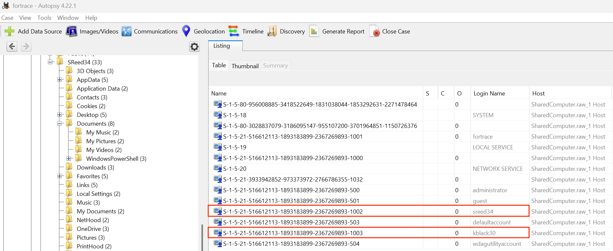
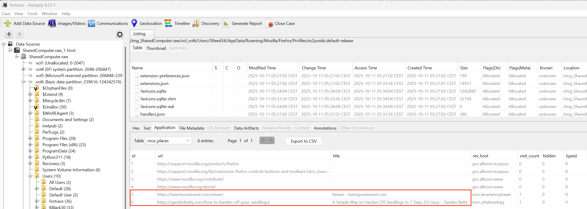
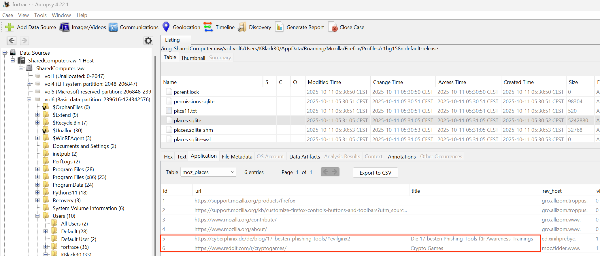
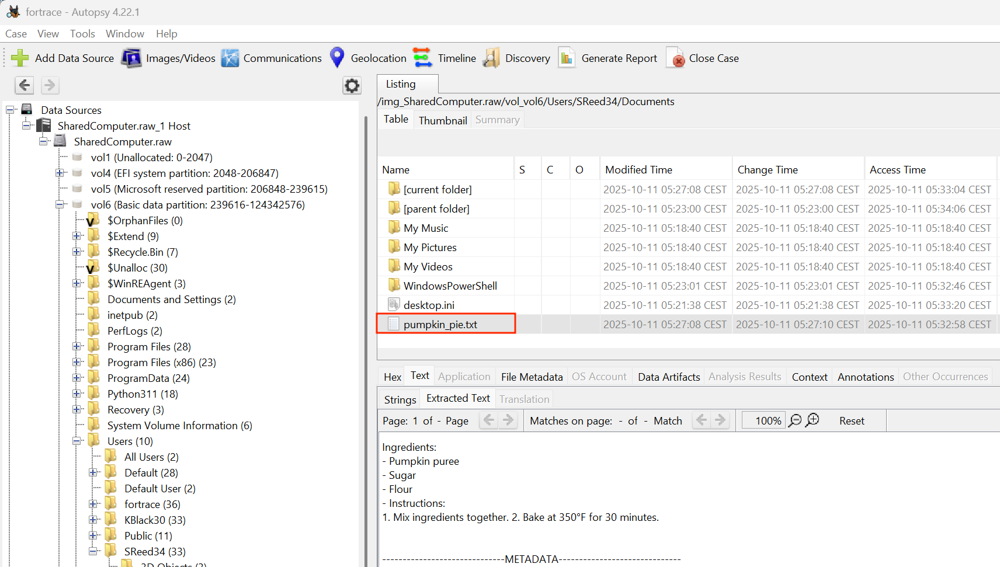
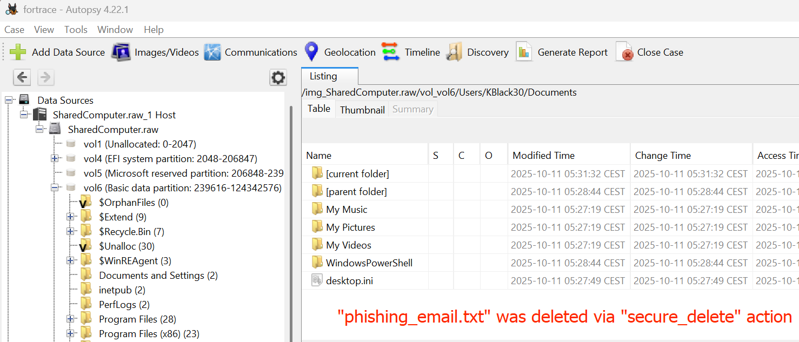

# Appendix: 6.3. Evaluation of a Synthetic Scenario Generated by GPT

An analysis of the generated disk image within Autopsy validates the presence of the activities and its strong coherence with our synthetic YAML configuration. The Windows registry and file system analysis confirmed the existence of the two Windows user accounts, *kblack30* and *sreed34*, as defined by our forensic scenario.

Crucially, the web browser history artifacts for the two users align with their interests and roles in the scenario. The innocent's *sreed34* profile showed benign searches for '*pumpkin carving ideas*' and related websites that we classify as background noise. The suspect's *kblack30* profile contained searches and webpage visits to sites referencing malicious activities such as '*how to hide a phishing email*' and a Google search for phishing related tools.

A further analysis of the filesystem confirmed the presence of the text file *pumpkin.txt*. It contained the expected pumpkin recipe of the user account *sreed34*. We were not able to locate the file *phishing\_email.txt* in the user folder of *kblack30* as it was been deleted by anti-forensics (*sdelete*).

Our analysis confirms that the generated disk image is coherent with our synthetic YAML configuration.
