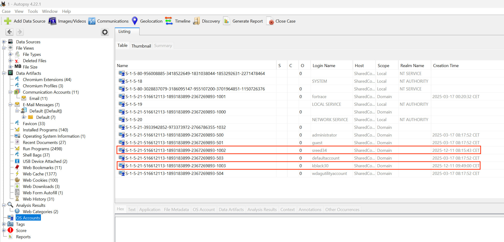
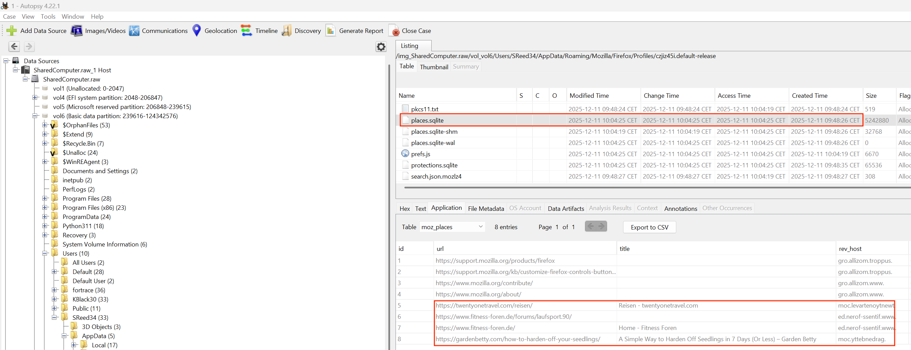
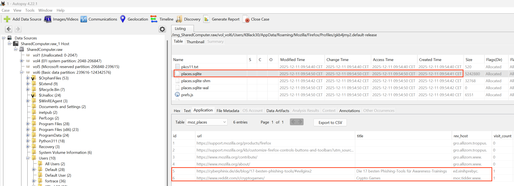
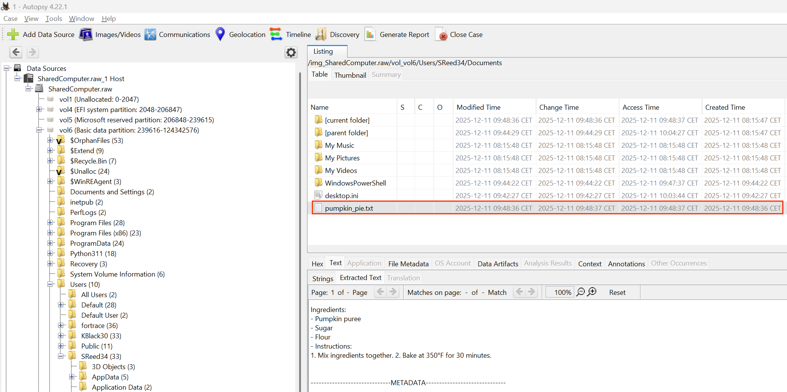
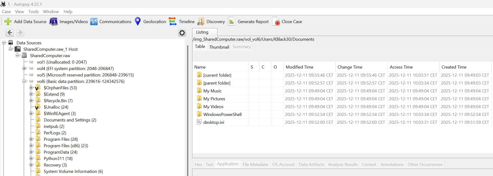
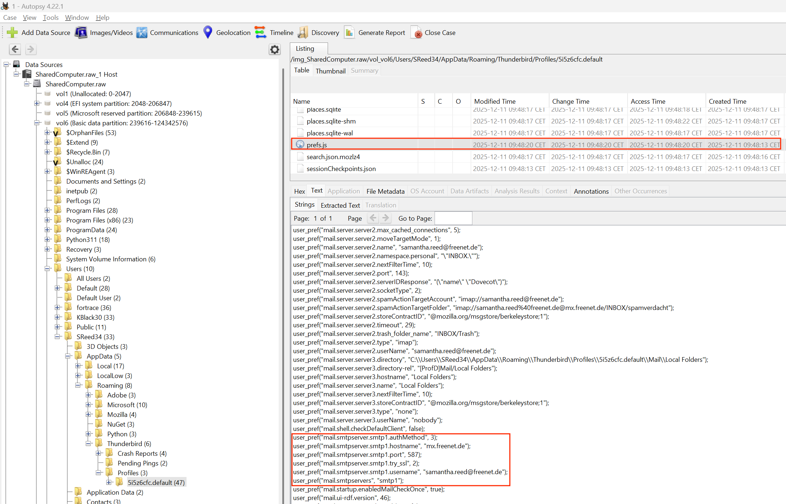
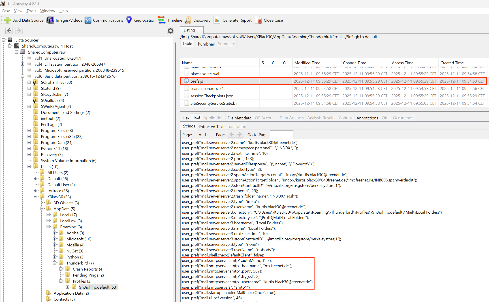
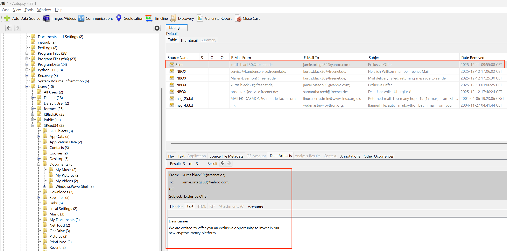

# Appendix: 6.3. Evaluation of a Synthetic Scenario Generated by GPT

The analysis of the generated disk image using Autopsy confirms the successful execution of the activities defined in the synthetic scenario and demonstrates strong coherence with the corresponding YAML configuration ([scenario.yaml](./scenario.yaml)), which was generated based on the outputs of the [prompts of chapter 6](./chapter-6-prompts.md).

A detailed examination of the Windows registry and file system artefacts verified the presence of the two Windows user accounts *kblack30* and *sreed34*, as specified by the forensic scenario. The associated account creation timestamps observed in Autopsy are internally consistent and plausible when correlated with system boot times and preceding user activity. Specifically, the account *sreed34* was created shortly after the scenario start time of 08:15 defined in the YAML configuration. Similarly, the interval between the system reboot at 09:42 and the creation of the *kblack30* account at 09:49 is reasonable, allowing for prerequisite system processes and initial user interactions prior (e.g., creating IMAP account, browsing the internet) to account creation.

Analysis of web browser artefacts further supports the internal coherence of the generated scenario. The browsing history associated with the innocent user *sreed34* consists exclusively of benign activities aligned with the defined interests *traveling*, *fitness*, and *gardening*. These artefacts are therefore classified as background activity and serve as noise within the dataset. In contrast, the browsing history of the suspect account *kblack30* contains a visit to a website discussing rankings of phishing tools, which we classify as malicious or case-relevant activity. Additionally, the suspect accessed a subreddit related to cryptocurrency games. Both artefacts are consistent with the suspect’s assigned interests in *hacking*, *cybersecurity*, and *cryptocurrencies*, thereby reinforcing the semantic alignment between persona definition and generated system activity.

File system analysis confirmed the presence of the text file *pumpkin\_pie.txt* within the *Documents* directory of the user *sreed34*. The file contains the expected pumpkin recipe, matching the scenario description and further validating the successful synthesis of benign user content. In contrast, the file *phishing\_email.txt*, which was originally generated for the suspect *kblack30*, could not be recovered from the disk image. This absence is consistent with the execution of ForTrace’s anti-forensic module (sdelete), which was configured to securely delete the file during scenario execution.

Furthermore, the forensic analysis revealed the presence of two configured Thunderbird mailboxes, *kurtis.black30@freenet.de* and *samantha.reed@freenet.de*, which were created by ForTrace’s add_imap_account module. The recovered SMTP and IMAP settings of both accounts align precisely with the parameters defined in the YAML configuration, demonstrating correct and consistent execution of the synthesis process. Examination of the mailbox contents additionally confirmed that Kurtis Black sent an email to his external communication partner Jamie Ortega (*jamie.ortega89@yahoo.com*), thereby providing evidence of external-only interaction and reinforcing that the scenario’s roles and communication constraints were upheld. No indications of physical or interactive system access by the external partner were found, and all attributable traces are limited to communication artefacts.

Overall, the forensic analysis confirms that the generated disk image is internally consistent and reflects the activities, roles, and constraints defined in the synthetic YAML configuration. These results demonstrate the practical feasibility and forensic soundness of the proposed LLM-driven scenario generation and execution workflow.
